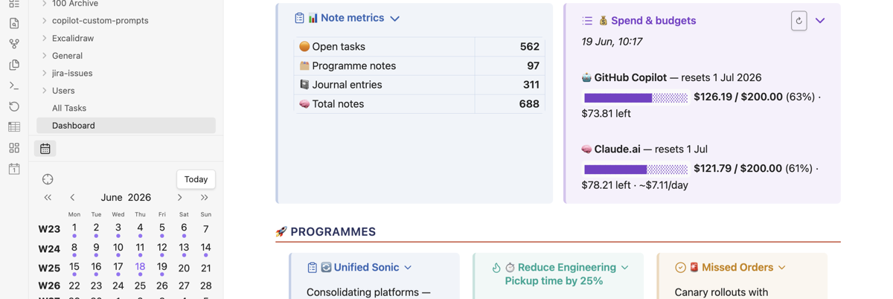

# Obsidian AI Spend Tracker

> Track your **GitHub Copilot** and **Claude.ai** programmatic credit spend directly in Obsidian — live budget bars in a sidebar panel, with smart caching to avoid API rate limits.



---

## Table of contents

- [Requirements](#requirements)
- [Installation](#installation)
- [First-time setup](#first-time-setup)
- [Using the plugin](#using-the-plugin)
- [Settings reference](#settings-reference)
- [Troubleshooting](#troubleshooting)
- [Building from source](#building-from-source)

---

## Requirements

| Requirement | Notes |
|---|---|
| **macOS** | The plugin uses the macOS Keychain to read Claude Code credentials. Windows/Linux not supported. |
| **Obsidian 1.4.0+** | Tested on 1.12+ |
| **Claude Code** | Must be installed and authenticated. Run `claude auth status` in Terminal to verify. |
| **uv** | Required for Copilot spend. Install with `brew install uv`. |

---

## Installation

### Option A — Manual install (recommended)

1. Go to the [latest release](https://github.je-labs.com/ken-tse/obsidian-ai-spend-tracker/releases/latest)
2. Download these three files:
   - `main.js`
   - `manifest.json`
   - `styles.css`
3. In your vault, create the folder:
   ```
   <your-vault>/.obsidian/plugins/ai-spend-tracker/
   ```
4. Copy the three downloaded files into that folder
5. Open Obsidian → **Settings → Community plugins**
6. If you see a "Safe mode" warning, click **Turn on community plugins**
7. Find **AI Spend Tracker** in the list and toggle it on

### Option B — Build from source

```bash
# 1. Clone the repo
git clone https://github.je-labs.com/ken-tse/obsidian-ai-spend-tracker
cd obsidian-ai-spend-tracker

# 2. Install dependencies
npm install

# 3. Build
npm run build

# 4. Copy to your vault
cp main.js manifest.json styles.css \
  "/path/to/your/vault/.obsidian/plugins/ai-spend-tracker/"
```

Then enable the plugin in **Settings → Community plugins**.

---

## First-time setup

After enabling the plugin, open **Settings → AI Spend Tracker** and configure:

### 1. Set your macOS Keychain account

This is your macOS username — the same account that Claude Code uses to store credentials.

To find it, open Terminal and run:
```bash
id -un
```

Paste the result (e.g. `ken.tse`) into the **macOS Keychain account** field. If you leave it blank the plugin will try to auto-detect it, but setting it explicitly is more reliable.

### 2. Verify Claude Code is authenticated

In Terminal:
```bash
claude auth status
```

You should see your email and `loggedIn: true`. If not, run `claude auth login` first.

### 3. Verify Copilot spend works

In Terminal:
```bash
uvx copilot-spend
```

If it asks you to log in, run:
```bash
uvx copilot-spend login
```

### 4. Set your budgets

- **Claude.ai monthly budget** — find this at [claude.ai → Settings → Usage limits](https://claude.ai/settings/limits). It's the "Spend limit" figure (e.g. `$200.00`).
- **GitHub Copilot budget** — your monthly entitlement from your Copilot plan. The API usually returns this automatically; the setting is a fallback.

---

## Using the plugin

### Opening the panel

Three ways to open the AI Spend Tracker panel:

1. **Ribbon icon** — click the **$** icon in the left sidebar
2. **Command palette** — `Cmd+P` → type `AI Spend` → select **Open AI Spend Tracker**
3. **Keyboard shortcut** — assign one in **Settings → Hotkeys** → search `AI Spend`

### Reading the panel

```
💰 AI Spend Tracker
Updated 17 Jun · 15:26

🤖 GitHub Copilot         Resets 1 Jul 2026
████████████░░░░░░░░  $117.75 / $200.00   59%
$82.25 left

🧠 Claude.ai              Resets 1 Jul
██████████░░░░░░░░░░  $98.23 / $200.00    49%
$101.77 left · ~$7.83/day

────────────────────────────────
Total this month: $215.98
```

| Element | Meaning |
|---|---|
| **Progress bar colour** | 🟢 Green = under 70% · 🟡 Amber = 70–89% · 🔴 Red = 90%+ |
| **Cached X min ago** | Data was fetched earlier and is being served from cache |
| **~$X/day** | Budget remaining divided by days left in the month |
| **Total this month** | Combined Copilot + Claude.ai spend |

### Refreshing data

- Data is cached for **4 hours** by default to avoid hitting API rate limits.
- To force a fresh fetch, click the **↻ Refresh** button at the top of the panel.
- You can also use the command palette: `AI Spend: Refresh spend data (force)`.

### When data shows "Unavailable"

If a service shows ⚠️ Unavailable, see the [Troubleshooting](#troubleshooting) section.

---

## Settings reference

| Setting | Default | Description |
|---|---|---|
| **macOS Keychain account** | *(auto)* | Your macOS username (`id -un`). Used to read Claude Code credentials from Keychain. |
| **Claude.ai monthly budget** | `$200` | Your programmatic credit pool limit from claude.ai → Settings → Usage limits. |
| **GitHub Copilot budget** | `$200` | Fallback budget used if the Copilot API doesn't return an entitlement value. |
| **Cache TTL (hours)** | `4` | How long to cache spend data before re-fetching. Minimum 1h recommended. |
| **Binary PATH** | `/opt/homebrew/bin:/usr/bin:/bin` | The PATH used when running shell commands. Default works for Homebrew on Apple Silicon. On Intel Macs change `/opt/homebrew` to `/usr/local`. |
| **Show ribbon icon** | On | Toggles the $ icon in the left ribbon. Takes effect after restarting Obsidian. |

---

## Troubleshooting

### Claude.ai shows "Unavailable"

**Check 1 — Claude Code is authenticated:**
```bash
claude auth status
```
You should see your email and `loggedIn: true`. If not: `claude auth login`

**Check 2 — Keychain account is correct:**
```bash
id -un
```
Make sure this matches the **macOS Keychain account** setting exactly.

**Check 3 — The credential exists in Keychain:**
```bash
security find-generic-password -s "Claude Code-credentials" -a "$(id -un)" -w | python3 -c "import json,sys; d=json.load(sys.stdin); print('token length:', len(d['claudeAiOauth']['accessToken']))"
```
You should see `token length: 108`. If you get an error, re-authenticate with `claude auth login`.

**Check 4 — Rate limiting:**
The Anthropic usage endpoint rate-limits heavy polling. If you've been refreshing frequently, wait 10–15 minutes and try again, or increase the Cache TTL to reduce calls.

---

### GitHub Copilot shows "Unavailable"

**Check 1 — uv is installed:**
```bash
which uvx
```
If not found: `brew install uv`

**Check 2 — Copilot spend is authenticated:**
```bash
uvx copilot-spend
```
If it prompts for login: `uvx copilot-spend login`

**Check 3 — PATH setting:**
Make sure `/opt/homebrew/bin` is in the plugin's **Binary PATH** setting. On Intel Macs use `/usr/local/bin` instead.

---

### Panel doesn't open

- Check **Settings → Community plugins** — ensure AI Spend Tracker is enabled
- Try the command palette: `Cmd+P` → `Open AI Spend Tracker`
- Restart Obsidian if you just installed the plugin

---

### "Binary PATH" errors in the console

Open Obsidian DevTools (`Cmd+Option+I`) and check the Console tab for `[AI Spend]` errors. The most common cause is `uvx` or `curl` not being found — add their directory to the **Binary PATH** setting.

---

## Building from source

```bash
git clone https://github.je-labs.com/ken-tse/obsidian-ai-spend-tracker
cd obsidian-ai-spend-tracker
npm install
npm run build   # produces main.js
```

For development with hot-reload:
```bash
npm run dev
```

---

## How it works

| Data source | Method |
|---|---|
| **Claude.ai spend** | Reads your OAuth token from macOS Keychain (written by Claude Code), then calls `https://api.anthropic.com/api/oauth/usage` — the same endpoint that powers the status bar in Claude Code and the Settings page at claude.ai |
| **Copilot spend** | Shells out to `uvx copilot-spend --json` ([copilot-spend](https://pypi.org/project/copilot-spend/) by [@nicktindall](https://github.com/nicktindall)) |
| **Caching** | Results stored in `<plugin-dir>/spend-cache.json` for the configured TTL to avoid rate limits |

---

## License

MIT © Ken Tse
